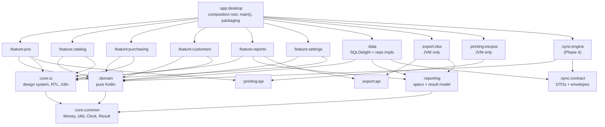

# Keswa — Architecture

**Clean Architecture + MVI.** Kotlin Multiplatform + Compose Multiplatform. Desktop (JVM/Windows) first, offline-only,
single machine. Android / iOS / Web and a Ktor+Postgres backend arrive later and must be
**additive**: new modules and new source sets, no rewrite of domain, schema, or sync semantics.

> The presentation contract (MVI store, contracts, reducer purity, effects) is specified in
> [presentation-architecture.md](presentation-architecture.md). This document covers modules,
> dependency rules and platform concerns.

---

## 1. Context and constraints that drive the design

| Fact | Architectural consequence |
|---|---|
| Solo dev, ~10h/week | Few modules, no framework zoo, no code generation beyond SQLDelight. Every abstraction must pay for itself within 2 phases. |
| Backend planned ~3 months out (Ktor + PostgreSQL) | `:sync:contract` is written in **Phase 0**, not Phase 4. The local schema is designed as a Postgres schema that happens to run on SQLite. |
| Shop has no POS today (Excel + notebook) | Data-in is the first real deliverable. Catalog + stock count ships before the till. |
| One Windows machine, power cuts likely | Durability settings and backup are Phase 0, not "later". |
| Arabic-first, RTL | i18n is structural (no hardcoded strings anywhere, including logs shown to users), not a late pass. |
| Money and stock must reconcile across replicas | Ledgers are append-only; money is integer minor units. Non-negotiable. |

**ASSUMPTION:** Single legal entity, single currency in Phase 0–3. The schema carries `currency_code`
and `tenant_id` anyway so multi-currency / multi-tenant is a data change, not a schema change.

---

## 2. Module graph



### Module responsibilities

| Module | Targets | Contains | Never contains |
|---|---|---|---|
| `:core:common` | common | `Money`, `CurrencyCode`, `Ulid`, `Clock`, `DeviceId`, `AppResult`, logging facade | Anything domain-specific |
| `:domain` | common | Entities, value objects, **repository interfaces**, use cases, policy (pricing resolution, discount allocation, return rules), `Principal`/permissions | SQLDelight, Compose, Ktor, POI, `java.*` |
| `:data` | common + jvm | SQLDelight `.sq` + migrations, driver `expect/actual`, repo implementations, mappers, `UnitOfWork` (tx + audit + outbox), `SqlReportEngine` | UI, Compose, POI |
| `:reporting` | common | `ReportSpec`, `ReportRequest`, `ReportResult`, `ColumnSpec`, `ReportEngine` interface | SQL, POI, Compose |
| `:export:api` | common | `ReportExporter` interface, `ExportTarget`, `ExportResult` | Any concrete format |
| `:export:xlsx` | **jvm only** | Apache POI renderer, RTL sheet handling, number formats | Domain logic |
| `:printing:api` | common | `ReceiptPrinter`, `ReceiptDocument`, `PrinterDescriptor` | Bytes, ESC/POS |
| `:printing:escpos` | **jvm only** | Raster rendering + ESC/POS, `javax.print` transport, A4 via PDFBox | Domain logic |
| `:sync:contract` | common | Wire DTOs, `ChangeEnvelope`, `PullRequest/Response`, error codes, protocol version | Persistence, HTTP client |
| `:sync:engine` | common | Outbox drain, cursor pull, conflict application (Phase 4) | UI |
| `:core:ui` | common | Theme, typography (Arabic fonts), RTL scaffolding, shared components, `Strings` accessor, **MVI base (`MviStore`, `MviState`, `MviIntent`, `MviEffect`)** | Business rules |
| `:feature:*` | common | Per screen: `Contract` (State/Intent/Effect), `Store`, stateless `Screen`, thin `Route` | Direct DB access, platform APIs, business rules |
| `:app:desktop` | jvm | `main()`, window, DI graph, platform bindings, jpackage config | Business logic |

### Dependency rules (enforced, not aspirational)

**Allowed**
- `:domain` → `:core:common` + kotlinx-datetime/coroutines only.
- `:data` → `:domain`, `:reporting`, `:sync:contract`, `:core:common`.
- `:feature:*` → `:domain`, `:core:ui`, `:core:common`, and (reports only) `:reporting`, `:export:api`, (pos only) `:printing:api`.
- `:app:desktop` → everything. It is the **only** module allowed to see concrete implementations.

**Forbidden — these are the rules that keep the plan honest**

| Forbidden edge | Why |
|---|---|
| `:domain` → anything platform or persistence | Domain must compile for iOS/Web with zero changes |
| `:feature:*` → `:data` | Swapping local↔remote data sources must not touch UI |
| `:feature:*` → `:export:xlsx` / `:printing:escpos` | JVM-only deps would break Android/iOS/Web targets |
| `:reporting` → `:data` | Reports must be servable from the backend later |
| anything → `:app:*` | Composition root is a sink, never a source |
| `:export:*` / `:printing:*` → `:domain` | Renderers work on `ReportResult` / `ReceiptDocument` DTOs only |

**Enforcement:** a `dependency-rules` Gradle convention plugin fails the build on a violating
`project(...)` edge. ~40 lines, written in Phase 0. Without it these rules decay in a month.

### Composition root pattern (instead of `expect/actual` everywhere)

Use `expect/actual` **only** where the type must be resolved at compile time — realistically just
`SqlDriverFactory`. Everything else platform-specific is a **`:domain`/`:*:api` interface**, implemented
in `:app:desktop` or a JVM-only module, and bound in the DI graph:

```
interface FileVault      // backup/restore target       -> WindowsFileVault
interface AppPaths       // DB + backup + log locations -> WindowsAppPaths
interface ReceiptPrinter                                -> EscPosPrinter / A4PdfPrinter
interface ReportExporter                                -> XlsxExporter
interface PasswordHasher                                -> JvmArgon2Hasher
```

Why: `expect` forces *every* target to supply an `actual`, so adding an iOS target would break the
build over a printer you never intend to use there. Interfaces + DI make Android/iOS/Web **additive**.

**DI:** Koin. Manual constructor wiring is fine too; Koin's value is per-feature modules and easy
test overrides. **ASSUMPTION:** Koin over Kodein/manual — swap freely, nothing depends on it outside `:app:*`.

---

## 3. commonMain vs desktopMain

| Concern | commonMain | desktopMain / JVM-only module |
|---|---|---|
| Entities, use cases, policy | ✅ all | — |
| SQLDelight queries & migrations | ✅ `.sq` files | driver creation, file path, PRAGMAs |
| Repositories | ✅ interfaces + impls | — |
| MVI stores + contracts | ✅ | — |
| Compose screens (stateless) | ✅ | window chrome, menu bar, keyboard hooks |
| i18n strings | ✅ | — |
| Money/date formatting | ✅ (kotlinx-datetime + own formatter) | — |
| Report specs & SQL | ✅ | — |
| Excel export | interface only | POI impl |
| Printing | `ReceiptDocument` model + layout | raster + ESC/POS + `javax.print` |
| Backup scheduling | policy (when, retention) | `java.nio` file ops, `VACUUM INTO` |
| Barcode scanner | `ScanBuffer` state machine (pure, testable) | key event source wiring |
| Sync engine | ✅ all | HTTP engine choice |

**Rule of thumb:** if it can be expressed as *policy over data*, it goes in commonMain, even when
only desktop uses it today. `ScanBuffer` and backup retention are pure logic; only their *inputs*
are platform-bound. That is what makes the Android app cheap later.

---

## 4. Clean Architecture layering and the mutation path

Three layers, dependencies pointing **inward only**. Full contract in
[presentation-architecture.md](presentation-architecture.md).

| Layer | Modules | Owns | Never knows about |
|---|---|---|---|
| **Presentation** | `:feature:*`, `:core:ui`, `:app:*` | Compose screens, MVI stores, navigation, formatting | SQL, SQLDelight types, HTTP, POI, `java.*` |
| **Domain** | `:domain`, `:core:common` | Entities, value objects, use cases, policy, repository **interfaces**, `Principal`, typed errors | Compose, persistence, platform, frameworks |
| **Data** | `:data`, `:sync:*` | Repository **implementations**, SQLDelight, mappers, `UnitOfWork`, `ReportEngine` impl | UI state, navigation, Compose |

`:domain` declares `interface SaleRepository`; `:data` implements it; `:feature:pos` only ever sees the
interface; `:app:desktop` binds them. That inversion is what makes local↔remote data sources swappable,
and it is enforced by the dependency-rules plugin rather than by discipline.

### The mutation path, end to end

```
Compose screen (stateless)
  → Store.dispatch(Intent)                          presentation, MVI
    → reduce(state, intent)                         pure, synchronous
    → handle(intent, state)                         async
      → UseCase(principal, …)                       domain — business rules live here
        → Repository interface                      domain
          → RepositoryImpl                          data
            → UnitOfWork.transaction(principal) {
                 1. write business rows
                 2. append stock_movement / customer_ledger rows   (append-only)
                 3. update materialized levels                     (same tx)
                 4. append audit_event                             (same tx)
                 5. append outbox_entry                            (same tx)
               }
      → dispatch(Intent.Internal.Result)             result re-enters as an intent, same entry point
      → emit(Effect.PrintReceipt)                   one-shot side effect
```

`UnitOfWork` is the single choke point for every mutation. It guarantees that audit and outbox can
never drift from the data — the property that makes sync and audit trustworthy. Reads bypass it.

**Model mapping:** DB↔domain and wire↔domain are always mapped (generated and DTO types stay inside
`:data`). Domain↔UI is normally *not* mapped — domain models go straight into `State` and are formatted
at render time. See presentation-architecture.md §1.1 for why, and what the strict alternative costs.

**Concurrency:** one SQLite writer. All writes go through a single-threaded dispatcher owned by
`UnitOfWork`; reads use SQLDelight flows on IO. With WAL, readers never block the writer.

**Errors:** `AppResult<T>` (sealed) across module boundaries — no exceptions as control flow across
layers. Domain errors are typed (`InsufficientStock`, `ReturnExceedsOriginal`, `ShiftAlreadyOpen`) and
carried into `State` as an `ErrorKey`, resolved to Arabic in `:core:ui`. Never surface an English
exception message to the cashier.

---

## 5. MVI presentation, navigation, and screen shape

Every screen is one **Contract** (`State`, `Intent`, `Effect`), one **Store**, one stateless
**Screen** composable, and a thin **Route** that owns the store and consumes effects.
Full specification, base class and examples: [presentation-architecture.md](presentation-architecture.md).

- **State** — immutable, everything needed to render. If restoring it would reproduce the screen exactly, it is State.
- **Intent** — user actions plus `Internal` results fed back from use cases. Nothing else mutates state.
- **Effect** — one-shot only (print, navigate, focus, open drawer). If doing it twice would be a bug, it is an Effect. Errors and loading flags are **State**, not effects.
- **`reduce(state, intent)` is pure** — no I/O, no clock, no coroutines — so every transition is testable with zero infrastructure. Async work lives in `handle`, and its results re-enter as intents.
- **Store host:** `androidx.lifecycle.ViewModel` (the KMP artifact — jvm/android/ios/wasm) for `viewModelScope`. **ASSUMPTION:** if that artifact causes friction on a target, the fallback is a plain class with an explicitly cancelled `CoroutineScope`; nothing else changes. See [ADR-011](adr/ADR-011-mvi-unidirectional-presentation.md).
- **Navigation:** a sealed `Screen` hierarchy + a stack held in `:app:desktop`. Stores never navigate; they emit `Effect.Navigate`. **ASSUMPTION:** no navigation library in Phase 0–3; ~9 screens do not justify one. Revisit at Android (Phase 5).
- **POS is keyboard-first**: every action reachable without a mouse — a hard UX constraint that affects component choice (custom focus handling, no reliance on hover). See presentation-architecture.md §4 for the recomposition budget that keeps scanning fast.

---

## 6. Arabic-first / RTL

| Decision | Detail |
|---|---|
| Default locale | `ar`. English is the fallback, not the source of truth. |
| Strings | Compose Multiplatform Resources (`composeResources/values/strings.xml`, `values-ar/`). A lint/CI grep fails the build on string literals inside `:feature:*` composables. |
| Layout direction | `LocalLayoutDirection = Rtl` at the app root, driven by locale. Use `Modifier.padding(start/end)` — **never** `left/right`. |
| Fonts | Bundle **IBM Plex Sans Arabic** (OFL) — Skia on Windows will not reliably pick a good Arabic face. Bundling also makes receipts and PDFs deterministic. |
| Digits | Western digits (0–9) everywhere by default, with a setting for Eastern Arabic. **ASSUMPTION:** POS legibility, barcode entry, and Excel compatibility beat typographic preference. Confirm with the owner. |
| Mixed content | Never concatenate translated strings; use positional placeholders (`"%1$s"`). Bidi bugs in Arabic come almost entirely from concatenation. |
| Sorting | Arabic collation for product names — SQLite's default `BINARY` is wrong. Store a `name_sort` normalized column (strip tatweel/diacritics, unify alef forms) and sort on that. |

---

## 7. Desktop specifics

### 7.1 Where the database lives

```
C:\ProgramData\Keswa\
  data\keswa.db        keswa.db-wal   keswa.db-shm
  backups\             keswa-2026-09-08T2100.db ...
  logs\                keswa.log (rotating, 7 days)
  config\keswa.conf
```

- `%PROGRAMDATA%`, **not** `%LOCALAPPDATA%` — shop staff may log into different Windows accounts and
  must see the same data. Installer grants `Modify` to `Users` on `C:\ProgramData\Keswa`.
- Never inside `C:\Program Files\Keswa` — that directory is replaced on upgrade.
- Override order: `KESWA_DATA_DIR` env → `config\keswa.conf` → default. Needed for USB/dev/testing.
- Location is shown in Settings → About, with a "open folder" button. The owner will need it.

### 7.2 Durability and power cuts

| PRAGMA | Value | Reason |
|---|---|---|
| `journal_mode` | `WAL` | Readers don't block the writer; crash-safe |
| `synchronous` | `FULL` | **Not NORMAL.** Under WAL+NORMAL a power cut can lose the last committed transactions. A POS commits a few times per minute — the fsync cost is irrelevant, a lost sale is not. |
| `foreign_keys` | `ON` | SQLite defaults to OFF. Silent orphans otherwise. |
| `busy_timeout` | `5000` | Backup/checkpoint overlap |
| `wal_autocheckpoint` | `1000` | Bounded WAL growth |

**Mid-sale power cut:** a sale is committed as **one transaction** (header + lines + payments +
stock movements + audit + outbox). It is either entirely present or entirely absent — never half a
sale. Work in progress before that commit lives in a `DRAFT` sale which touches no ledger, so a lost
draft costs the cashier a re-scan and nothing else.

**On startup:** run `PRAGMA quick_check`. On failure → block the UI, offer guided restore from the
newest verified backup. Log the result either way.

### 7.3 Backup / restore (Phase 0 deliverable)

- Mechanism: `VACUUM INTO '<path>'` — consistent snapshot of a live DB, single statement, no
  external tooling. Simpler and safer than copying `.db`+`.wal`.
- Triggers: on app close, every 4h while running, and **before every schema migration**.
- Targets: local `backups\` folder **plus** an owner-configured second path (USB / network share).
  A backup that lives only on the failing machine is not a backup.
- Verify: after writing, open the file and run `quick_check` + compare `sale` row counts. Record the
  result in a `backup_log` table shown in Settings.
- Retention: 14 daily + 4 weekly + every pre-migration snapshot (kept forever).
- Restore: guided in-app flow — pick file → verify → snapshot current DB aside → swap → restart.

### 7.4 Barcode scanner (keyboard-wedge / HID)

The scanner is a keyboard. Handle it as a **pure state machine** in commonMain:

```
ScanBuffer: chars arriving < 40ms apart, terminated by Enter, length >= 6  ->  Scan(code)
            anything slower  ->  ignore, let the focused field have it
```

- Wired at the window root via `Modifier.onPreviewKeyEvent` so it works regardless of focus.
- **The Arabic-layout trap:** if Windows' active input language is Arabic, HID keystrokes arrive as
  Arabic letters and barcodes are garbage. Mitigations, in order: (1) read `KeyEvent.key` / physical
  key codes rather than typed characters; (2) map digit-row physical keys to digits explicitly;
  (3) configure the scanner to emit a prefix character and validate. Test this on day one of Phase 3
  with the real device — it is the single most likely hardware surprise.
- Always ship a manual barcode entry field. Scanners fail.

### 7.5 Receipt printing

- **Thermal (ESC/POS):** do **not** use the printer's text mode for Arabic. Cheap printers have no
  Arabic codepage, or CP864 without contextual shaping — output is disconnected, reversed letters.
  Instead: lay out the receipt with Java2D/Skia (JVM has correct Arabic shaping + bidi), rasterize to
  a 1-bit bitmap at the printer's dot width (384px @58mm, 576px @80mm), send as `GS v 0`. See ADR-010.
- **Transport:** `javax.print` RAW (`DocFlavor.BYTE_ARRAY.AUTOSENSE`) to the installed Windows queue.
  Works with vendor drivers and shared printers; avoids USB/COM handling.
- **A4:** render `ReceiptDocument`/invoice to PDF via PDFBox, then print or save. Same document model.
- `:printing:api` exposes a `ReceiptDocument` (semantic blocks: header, lines, totals, footer) so a
  future Android/web app can render it differently without re-deriving content.

### 7.6 Packaging and distribution (Windows)

- Compose `packageDistributionForCurrentOS` → **jpackage MSI**, bundled JRE (jlink). No Java on the
  shop PC.
- Versioning: semver `MAJOR.MINOR.PATCH` in `gradle.properties`; MSI requires purely numeric
  `x.y.z`, so build metadata goes in a separate `build_number` resource shown in About.
- **Unsigned MSI trips SmartScreen.** Either buy an OV code-signing certificate (~$200–400/yr,
  requires org validation) or accept "More info → Run anyway" during install. Decide before the shop
  install, not during it. **ASSUMPTION:** unsigned for Phase 0–3, signed before multi-store rollout.
- Upgrade must never touch `C:\ProgramData\Keswa`. Verified by an explicit upgrade test in Phase 0.
- Auto-update (Phase 3): app polls a static `latest.json`, downloads the MSI, verifies SHA-256,
  launches the installer and exits. Manual "check for updates" ships first; nothing auto-installs
  during shop hours.

---

## 8. Testing strategy (proportional to a 10h/week budget)

| Layer | What is tested | Effort |
|---|---|---|
| `:domain` | Use cases: pricing resolution, discount allocation, return limits, shift math, money arithmetic. Pure, fast, no mocks. | **Highest ROI — write these.** |
| `:data` | Migration chain test (every version → latest), schema-hash test, ledger↔materialized-level reconciliation property test | Non-negotiable |
| `:reporting` | Each report against a seeded fixture DB, asserting totals | Medium |
| `:export:xlsx` | Golden-file test: Arabic text round-trips, money cells are numeric | Small, do it once |
| Presentation | **Reducer tests** (`reduce(state, intent) == expected`) — pure, no mocks, no dispatchers. Store tests with Turbine + fake use cases for POS, returns and shift close. | Cheap; the main reason MVI earns its ceremony here |
| UI | Manual. **ASSUMPTION:** no Compose UI tests before Phase 4 — not worth the hours solo. | — |

**Schema version test:** the build stores a hash of the current schema; changing `.sq` without
adding a migration fails CI. This is the guardrail that makes "no rewrite later" real.

---

## 9. What makes Android / iOS / Web additive later

| New target | What you add | What you change |
|---|---|---|
| Android | `:app:android`, androidMain driver actual, Android bindings for `AppPaths`/`FileVault` | Nothing in `:domain`, `:data` queries, `:feature:*` (contracts and stores are commonMain), `:reporting` |
| iOS | `:app:ios`, native driver actual, iOS bindings | Nothing — provided no `java.*` leaked below `:app:desktop` |
| Web (Wasm) | `:app:web`, remote-only `ReportEngine` + repos hitting the backend | Nothing — this is why `:reporting` must never depend on `:data` |
| Backend | Ktor service reusing `:domain` + `:sync:contract` as a Gradle include | Postgres DDL mirrors the SQLite schema; types were chosen to be portable |

The two things that would break this are (a) a JVM dependency creeping below `:app:desktop`, and
(b) `:feature:*` reaching into `:data`. Both are blocked by the dependency-rules plugin.
