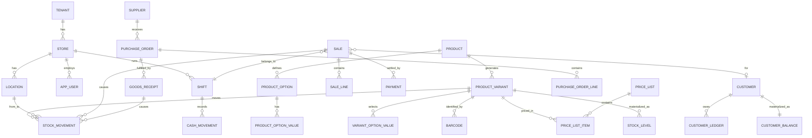

# Keswa — Data Model

SQLite via SQLDelight. Designed as a **Postgres schema that happens to run on SQLite**, so the
backend can mirror it in Phase 4 without translation.

---

## 1. Universal column contract

Every **mutable** table carries these columns. No exceptions, including tables that "obviously"
never sync.

| Column | Type | Rule |
|---|---|---|
| `id` | `TEXT PRIMARY KEY` | ULID, generated client-side. Never auto-increment. See ADR-001. |
| `tenant_id` | `TEXT NOT NULL` | Business/company. One value today. |
| `store_id` | `TEXT NOT NULL` | Owning store. On global rows (products) this is the *originating* store; visibility is controlled separately. |
| `created_at` | `INTEGER NOT NULL` | Unix millis, **UTC**. |
| `updated_at` | `INTEGER NOT NULL` | Unix millis, UTC. Bumped on every write. Sync ordering key. |
| `deleted_at` | `INTEGER` | Soft delete. `NULL` = live. **No hard deletes ever.** |
| `revision` | `INTEGER NOT NULL DEFAULT 1` | Incremented per local write. Conflict detection + optimistic locking. |
| `origin_device_id` | `TEXT NOT NULL` | Device that produced this revision. LWW tiebreaker. |
| `server_seq` | `INTEGER` | `NULL` until the server assigns one. Reserved in Phase 0, unused until Phase 4. |

**Append-only** tables (`stock_movement`, `customer_ledger`, `payment`, `audit_event`, `cash_movement`,
`outbox_entry`) carry `id`, `tenant_id`, `store_id`, `created_at`, `origin_device_id`, `server_seq` —
but **no** `updated_at`, `deleted_at`, or `revision`, because those rows are never modified. Reversal
is expressed by writing a new, opposite row. This is what makes them conflict-free (ADR-003, ADR-007).

**Indexes:** every table gets `(tenant_id, store_id, updated_at)` for sync pulls and
`(tenant_id, deleted_at)` for live-row scans. Ledger tables get `(tenant_id, store_id, created_at)`.

**Enums are TEXT codes**, never integers/ordinals: `'CASH'`, `'SALE'`, `'RETURN'`. Reordering a Kotlin
enum must not be able to corrupt data. Each is `CHECK`-constrained in the DDL.

---

## 2. Money

```kotlin
data class Money(val minor: Long, val currency: CurrencyCode)   // :core:common
```

| Rule | Detail |
|---|---|
| Storage | `..._minor INTEGER NOT NULL` + `currency_code TEXT NOT NULL` on every monetary row |
| Type | `Long`, not `Int` — a high-inflation currency overflows `Int` at ~21M minor units |
| Never | `Double`, `Float`, `BigDecimal` in persistence, DTOs, or reports |
| Scale | A `currency` table holds `minor_unit_exponent` (2 for most, 0 for zero-decimal currencies). Formatting reads it; arithmetic never does. |
| Rounding | Half-up, applied **once per line**, in `:domain`. Percent discounts and tax produce a rounded minor amount that is then stored — the stored amount is the truth, not the percentage. |
| Allocation | A document-level discount is split across lines by **largest-remainder**, so `sum(line_discounts) == document_discount` exactly. Without this, returns and margin reports drift by cents forever. |
| Invariant (tested) | For every sale: `sum(line_total) - document_discount + tax == sum(payment.amount)` for non-credit sales. |

**ASSUMPTION:** single currency per tenant in Phase 0–4. `currency_code` is present so that multi-currency
is a policy change, not a migration.

---

## 3. Tenancy, stores, devices, users

### `tenant`
`id, name, default_currency_code, created_at, ...`  — one row today.

### `store`
`id, tenant_id, code, name, address, phone, timezone, is_active`
`code` is short and human (`ST01`) and is the prefix for document numbers.

### `location`
`id, tenant_id, store_id, code, name, kind` where `kind ∈ SALES_FLOOR | STOCKROOM | TRANSIT | SUPPLIER | CUSTOMER | ADJUSTMENT`

Stock always moves **between locations**. The pseudo-locations (`SUPPLIER`, `CUSTOMER`, `ADJUSTMENT`)
make every movement double-entry, so the ledger always balances and "where did 3 shirts go" is
answerable. **ASSUMPTION:** Phase 0 creates exactly one `SALES_FLOOR` location per store, invisible in
the UI until Phase 5. Modelling it now costs one column; retrofitting it costs a data migration.

### `device`
`id (ULID), tenant_id, store_id, label, os, app_version, registered_at, last_seen_at`
Generated on first launch, persisted in `config\keswa.conf`. Every row's `origin_device_id` points here.

### `app_user`
`id, tenant_id, store_id, full_name, username, pin_hash, pin_salt, role_code, is_active, must_change_pin, locked_until, failed_attempts`

- `role_code ∈ OWNER | MANAGER | CASHIER | STOCK_CLERK`
- PIN hashed with Argon2id (JVM impl behind `PasswordHasher` in `:domain`). Never store the PIN.
- Lockout after 5 failures for 5 minutes — a 4-digit PIN is brute-forceable in seconds otherwise.

### `role_permission`
`role_code, permission_code` — permissions as data, not a Kotlin `when`. Lets the owner get a
"cashiers can't discount over 10%" toggle later without a release.

**Permission codes (Phase 1):** `SALE_CREATE`, `SALE_VOID`, `RETURN_CREATE`, `DISCOUNT_APPLY`,
`DISCOUNT_OVER_LIMIT`, `PRICE_OVERRIDE`, `STOCK_ADJUST`, `PO_CREATE`, `PO_RECEIVE`, `CUSTOMER_CREDIT_GRANT`,
`SHIFT_CLOSE`, `REPORT_VIEW_FINANCIAL`, `USER_MANAGE`, `SETTINGS_EDIT`, `BACKUP_RESTORE`.

### `Principal` (not a table)
```kotlin
data class Principal(
  val userId: String, val tenantId: String, val storeId: String,
  val deviceId: String, val roleCode: String, val permissions: Set<String>
)
```
Every use case takes a `Principal`. In Phase 1 it comes from a local PIN unlock; in Phase 4 from a JWT.
**Call sites never change.** See ADR-008.

---

## 4. Catalog: products, variants, the size × colour matrix

Clothing needs a real option matrix. A `size TEXT, color TEXT` pair looks fine until the first product
with size × colour × length, and then it is a migration across every sale line ever recorded.

```
product                 1 ── n  product_option        (Size, Colour, Fit …; max 3 per product)
                                    1 ── n  product_option_value   (S/M/L; Red/Blue)
product                 1 ── n  product_variant
product_variant         1 ── n  variant_option_value  (variant ↔ one value per option)
product_variant         1 ── n  barcode
```

### `product`
`id, tenant_id, store_id, code, name_ar, name_en, name_sort, category_id, brand_id, supplier_default_id,`
`description, is_active, track_stock, tax_rate_bp, image_path`

- `name_ar` is the primary display name; `name_en` optional. `name_sort` is the normalized Arabic
  sort key (see architecture §6).
- `tax_rate_bp` = basis points (1500 = 15%). Integer, like money. **ASSUMPTION:** no VAT is charged
  today; the column exists and defaults to 0 so enabling tax is a data change.

### `product_variant`
`id, tenant_id, store_id, product_id, sku, name_suffix, cost_minor, currency_code, is_active,`
`weight_grams, position`

- `sku` is `UNIQUE(tenant_id, sku)` — human-facing, generated as `PRD-0042-RED-M` or typed.
- `cost_minor` = **current weighted-average cost**, maintained by the ledger, not typed by a user.

### `barcode`
`id, tenant_id, variant_id, code, kind, is_primary` — `kind ∈ EAN13 | UPC | CODE128 | INTERNAL | SUPPLIER`

A separate table because one variant genuinely has several codes: the manufacturer's, the supplier's
carton code, and your own printed label. `UNIQUE(tenant_id, code)`.

### `category` / `brand`
`id, tenant_id, name_ar, name_en, parent_id (category only), position`

### Variant generation
The UI in Phase 0 presents a Size × Colour grid and generates the cross-product, letting the user
untick impossible combinations. The **schema** supports 3 options; the **UI** exposes 2 until asked
otherwise. Schema is expensive to change, UI is cheap. See ADR-009.

---

## 5. Inventory: the stock ledger

### `stock_movement` (append-only, the single source of truth)

| Column | Notes |
|---|---|
| `id, tenant_id, store_id, created_at, origin_device_id, server_seq` | Standard append-only header |
| `occurred_at` | Business time (may differ from `created_at` for backdated counts) |
| `variant_id` | |
| `from_location_id`, `to_location_id` | Double-entry. One may be a pseudo-location. |
| `qty` | `INTEGER NOT NULL CHECK (qty > 0)` — **always positive**; direction comes from from/to |
| `unit_cost_minor`, `currency_code` | Cost at the moment of movement; required for inbound |
| `reason_code` | `PURCHASE_RECEIPT, SALE, RETURN_IN, RETURN_TO_SUPPLIER, COUNT_ADJUST, DAMAGE, THEFT, TRANSFER, OPENING_BALANCE, EXCHANGE_OUT, EXCHANGE_IN` |
| `ref_type`, `ref_id` | Document that caused it (`SALE`, `PURCHASE_ORDER`, `STOCK_COUNT`) |
| `note`, `user_id` | |

**Rules**
1. Rows are never updated or deleted. A mistake is corrected by a **reversing movement** that swaps
   `from`/`to` and carries `ref_type='REVERSAL', ref_id=<original id>`.
2. Quantities are whole units. **ASSUMPTION:** clothing is sold by the piece; no fractional units.
   If fabric-by-the-metre is ever needed this becomes `qty_milli INTEGER` — flag it now if relevant.
3. Every movement is written inside the same transaction as its causing document.

### `stock_level` (materialized, derived, never hand-edited)
`tenant_id, store_id, location_id, variant_id, qty_on_hand, qty_reserved, avg_cost_minor,`
`last_movement_at, PRIMARY KEY (tenant_id, location_id, variant_id)`

- Updated in the same transaction as the movement.
- **Rebuildable**: `rebuildStockLevels()` recomputes every row from `stock_movement`. Exposed in
  Settings → Maintenance, run automatically after any restore, and asserted by a property test
  ("ledger sum == materialized level" over random operation sequences). This is the safety net that
  lets you trust a derived table.
- `avg_cost_minor` uses **weighted moving average**: on inbound,
  `new_avg = (qty_on_hand*avg + qty_in*unit_cost) / (qty_on_hand + qty_in)`, integer division with the
  remainder carried in a `cost_rounding_minor` column so cost never leaks. FIFO layers rejected in ADR-003.
- Negative `qty_on_hand` is **allowed** and surfaced as a warning, not blocked. A shop that can't sell
  an item because the count is wrong will stop using the app. Report it; don't prevent it.
  **ASSUMPTION:** confirm — some owners want a hard block. It's a settings flag either way.

### `stock_count` / `stock_count_line`
Physical inventory sessions: header (`status ∈ DRAFT|COUNTING|POSTED`), lines
(`variant_id, counted_qty, snapshot_qty, variance_qty`). Posting emits `COUNT_ADJUST` movements —
it never writes `stock_level` directly.

---

## 6. Pricing

### `price_list`
`id, tenant_id, store_id, code, name_ar, channel_code, currency_code, valid_from, valid_to, priority, is_active`
`channel_code ∈ RETAIL | WHOLESALE | STAFF | ONLINE`

### `price_list_item`
`id, tenant_id, price_list_id, variant_id, price_minor, min_qty, currency_code`
`min_qty` supports wholesale break pricing (1+ / 12+ / 50+).

### `customer_price_list`
`customer_id, price_list_id` — a specific customer's negotiated list.

### Resolution order (in `:domain`, pure and unit-tested)
```
1. customer-specific price list  (matching min_qty, highest qualifying)
2. price list for the sale's channel, highest priority, date-valid
3. default RETAIL list
4. error: NoPriceForVariant  (never fall back to cost, never to zero)
```

**The resolved price is snapshotted onto `sale_line.unit_price_minor`.** A report must never re-derive
a historical price from today's price list. Also snapshot `price_list_id` for auditability.

---

## 7. Sales, returns, exchanges

One document type covers all three. A return is not a second system.

### `sale`
| Column | Notes |
|---|---|
| standard mutable columns | |
| `doc_type` | `SALE | RETURN | EXCHANGE` |
| `doc_number` | `ST01-INV-000123`, from a per-store counter. **Never a primary key.** |
| `status` | `DRAFT | COMPLETED | VOIDED` |
| `original_sale_id` | Set for RETURN/EXCHANGE |
| `customer_id` | Nullable (walk-in) |
| `channel_code` | Drives price resolution |
| `shift_id`, `user_id`, `location_id` | |
| `occurred_at`, `completed_at`, `voided_at`, `void_reason` | |
| `subtotal_minor, discount_minor, tax_minor, total_minor, paid_minor, balance_minor, currency_code` | All snapshotted |
| `note` | |

### `sale_line`
`id, sale_id, line_no, variant_id, qty (signed), unit_price_minor, price_list_id,`
`discount_type, discount_value, discount_minor, tax_rate_bp, tax_minor, line_total_minor,`
`unit_cost_snapshot_minor, origin_sale_line_id, currency_code`

- `qty` is **signed**: positive = out to customer, negative = back from customer. An **exchange is one
  document containing both**, settled by the payment delta. No separate exchange machinery.
- `unit_cost_snapshot_minor` freezes COGS at sale time — margin reports must not shift when costs change.
- `origin_sale_line_id` enables the rule *cumulative returned qty ≤ originally sold qty*, enforced in
  `:domain` and covered by a test.

### `payment` (append-only)
`id, sale_id, method_code, amount_minor, currency_code, direction, reference, tendered_minor,`
`change_minor, created_at, user_id`

- `method_code ∈ CASH | CARD | BANK_TRANSFER | MOBILE_MONEY | STORE_CREDIT | CUSTOMER_CREDIT`
- `direction ∈ IN | OUT` (OUT = refund)
- **Split payment = multiple rows.** No special case.
- `CUSTOMER_CREDIT` writes a `customer_ledger` CHARGE instead of moving cash — that's the only branch.
- Append-only: a wrong payment is reversed with an opposite row, never edited.

### Completion (one transaction)
```
sale.status = COMPLETED
+ assign doc_number
+ stock_movement per line (SALES_FLOOR → CUSTOMER, or reverse for negative qty)
+ payment rows
+ customer_ledger row if credit
+ audit_event
+ outbox_entry
```

### Voiding
A COMPLETED sale is **immutable**. Void writes `status=VOIDED` plus *reversing* stock movements and
opposite payment rows. No row is erased — a sale that appeared on a printed receipt must remain findable.

---

## 8. Customers and receivables

### `customer`
`id, tenant_id, store_id, code, name, phone, alt_phone, address, tax_number, notes,`
`credit_limit_minor, price_list_id, is_active`
**ASSUMPTION:** phone is the natural lookup key and is not unique (families share numbers). Indexed, not `UNIQUE`.

### `customer_ledger` (append-only — same discipline as stock)
`id, tenant_id, store_id, customer_id, entry_type, amount_minor, currency_code, ref_type, ref_id,`
`occurred_at, created_at, user_id, note, origin_device_id`

`entry_type ∈ CHARGE | PAYMENT | REFUND | ADJUSTMENT | WRITE_OFF`
Sign convention: `CHARGE` increases what the customer owes; `PAYMENT`/`REFUND`/`WRITE_OFF` decrease it.

### `customer_balance` (materialized, rebuildable)
`tenant_id, customer_id, balance_minor, last_entry_at, oldest_unpaid_at`

Same pattern as `stock_level`: derived, rebuildable, covered by a reconciliation test. A/R aging is
computed from the ledger, not from this table.

**Credit limit** is checked in `:domain` at sale completion; exceeding it requires
`CUSTOMER_CREDIT_GRANT` permission and writes an audit event with the override reason.

---

## 9. Suppliers and purchasing

### `supplier`
`id, tenant_id, code, name, phone, address, payment_terms_days, currency_code, notes, is_active`

### `purchase_order`
`id, ..., supplier_id, po_number, status, ordered_at, expected_at, location_id,`
`subtotal_minor, discount_minor, shipping_minor, other_cost_minor, total_minor, currency_code, note`
`status ∈ DRAFT | ORDERED | PARTIALLY_RECEIVED | RECEIVED | CANCELLED`

### `purchase_order_line`
`id, purchase_order_id, line_no, variant_id, qty_ordered, qty_received, unit_cost_minor,`
`discount_minor, line_total_minor, currency_code`

### `goods_receipt` / `goods_receipt_line`
Receiving is its own document (`receipt_number`, `received_at`, `user_id`, `po_id` nullable for
direct receipts). Each line emits a `PURCHASE_RECEIPT` movement `SUPPLIER → STOCKROOM`.

- Partial receipts are the norm — never assume one PO = one receipt.
- **Landed cost:** shipping/customs on the PO header are allocated across receipt lines by value and
  folded into `unit_cost_minor`, so average cost reflects what the goods really cost. Without this,
  every margin report is wrong. **ASSUMPTION:** allocate by line value; allocate-by-quantity is a setting.

### `supplier_return`
Mirrors goods receipt in reverse (`RETURN_TO_SUPPLIER`, `STOCKROOM → SUPPLIER`).

### `supplier_ledger` (append-only, Phase 2)
Accounts payable, structurally identical to `customer_ledger`. Same code path, different sign.

---

## 10. Cash drawer and shifts

### `shift`
`id, tenant_id, store_id, opened_by_user_id, opened_at, opening_float_minor,`
`closed_by_user_id, closed_at, counted_cash_minor, expected_cash_minor, variance_minor,`
`status ∈ OPEN | CLOSED, note`

### `cash_movement` (append-only)
`id, shift_id, kind, amount_minor, reason, created_at, user_id`
`kind ∈ OPENING_FLOAT | SALE_CASH | REFUND_CASH | PAY_IN | PAY_OUT | DROP | CLOSING_COUNT`

`expected_cash = opening_float + Σ(cash in) − Σ(cash out)`, computed from `cash_movement`, never typed.
Closing a shift with a variance requires a reason and writes an audit event. Only one `OPEN` shift per
store at a time (enforced by a partial unique index).

**Every sale carries `shift_id`.** No sale may be completed without an open shift — this is what makes
the Z-report reconcile, and it is the first thing the owner will check.

---

## 11. Audit log

### `audit_event` (append-only, never purged)
`id, tenant_id, store_id, occurred_at, user_id, device_id, entity_type, entity_id, action,`
`summary_json, before_json, after_json, reason, ip_or_host`

Written by `UnitOfWork` for every money- or stock-affecting action:
sale completion/void, return, price override, discount over limit, stock adjustment, count posting,
PO receipt, cost change, credit grant/override, payment reversal, shift close with variance, user
create/deactivate, role change, backup restore, settings change, migration run.

`before_json`/`after_json` hold only the changed fields — full snapshots would bloat the DB and leak
into sync payloads. `summary_json` holds a small, i18n-key-based description so the audit screen
renders in Arabic without re-deriving anything.

---

## 12. Sync scaffolding (Phase 1 schema, Phase 4 consumers)

### `outbox_entry`
`id, tenant_id, store_id, entity_table, entity_id, op (INSERT|UPDATE|DELETE), entity_updated_at,`
`created_at, status (PENDING|SENDING|SENT|FAILED), attempt_count, last_error, batch_id`

Stores a **pointer**, not a payload. At push time the row is re-read. Simpler, smaller, and always
current — the cost is losing intermediate states, which LWW discards anyway. Append-only ledger rows
never change, so re-reading is equally correct for them. See ADR-007.

### `sync_state`
`table_name, last_pulled_server_seq, last_pulled_at, last_pushed_at, last_error`
One row per synced table. Written by Phase 0's migration so Phase 4 adds no schema change.

### `sync_conflict`
`id, entity_table, entity_id, local_json, remote_json, resolution, resolved_at, resolved_by`
Empty in Phase 1. Its existence forces the question "what happens when both sides changed?" to be
answered now rather than during an outage.

**Phase 1 does write to `outbox_entry`.** An outbox that has never run is a fiction; one that has been
filling for months is a tested code path with real data to replay on day one of sync.

---

## 13. Reference / supporting tables

| Table | Purpose |
|---|---|
| `currency` | `code, minor_unit_exponent, symbol_ar, symbol_en` |
| `setting` | `tenant_id, store_id, key, value_json` — receipt header, tax on/off, digit style, backup paths, discount limits |
| `document_counter` | `tenant_id, store_id, doc_type, prefix, next_value` — per-store, per-type numbering |
| `backup_log` | `id, started_at, finished_at, path, size_bytes, verify_result, trigger` |
| `schema_migration` | `version, applied_at, app_version` — SQLDelight's own plus our audit of it |

---

## 14. Entity relationship overview



---

## 15. Migration discipline

1. **Every** schema change is a new `.sqm` file. Never edit an applied migration.
2. `1.sqm` exists from the first commit, even though the first release ships version 1 — so the
   migration machinery is exercised before it matters.
3. **Schema hash test:** CI hashes the generated schema and compares to a checked-in value. Changing
   `.sq` without a migration fails the build.
4. **Migration chain test:** for every version `v`, open a fixture DB at `v`, migrate to latest,
   assert the schema matches a freshly created one and that seeded rows survive.
5. A backup is taken **before** every migration, tagged `pre-migration-v<N>`, retained forever.
6. Migrations are idempotent-safe and wrapped in a transaction. A failed migration restores the
   pre-migration backup and refuses to start rather than running on a half-migrated DB.

---

## 16. Data-model decisions deliberately deferred

| Deferred | Why safe to defer | Trigger to revisit |
|---|---|---|
| Multi-currency pricing | `currency_code` present everywhere | Second currency appears |
| Serial/lot tracking | Clothing rarely needs it | Consignment goods |
| Fractional quantities | Sold by the piece | Fabric by the metre |
| Full double-entry accounting (GL) | Ledgers already give the raw material | Accountant asks for a trial balance |
| Product images at scale | `image_path` on `product` | Web catalogue |
| Tax jurisdictions | `tax_rate_bp` per product | VAT introduced |
| Loyalty / store credit balances | `STORE_CREDIT` payment method reserved | Owner asks |
