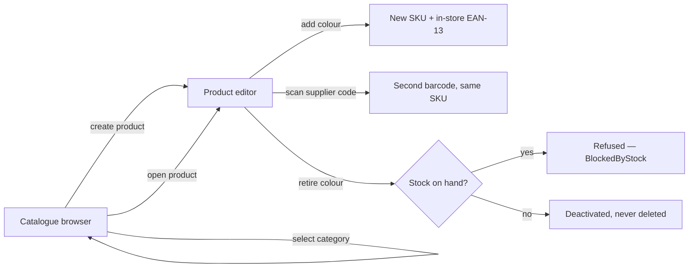

# `:features:catalog`

The admin builds their own category tree, files products under it, and gives each product its
colours. **Every colour is a SKU** — its own barcode, its own stock, its own price.

This is the reference implementation the later features are copied from: the MVI shape, the error
layering and the slot-based components here are the pattern, not just this screen's solution.

## Flow



## Decisions worth knowing

| | |
|---|---|
| **Colour is the only variant axis** | Sizes were removed on 14 Sep. The hierarchy that matters is the category tree, which the admin owns end to end. |
| **Barcodes are EAN-13 from the in-store range 20–29** | GS1 reserves that range for shop-printed codes, so a generated barcode can never collide with a manufacturer's GTIN — and any cheap scanner reads it with no configuration. |
| **A variant keeps several barcodes** | The supplier's and ours both resolve to the same SKU. That is why barcodes are their own table rather than a column. |
| **SKUs are readable (`OXF-NAV`)** | A SKU is what staff read off a tag when the scanner fails. Collisions get a numeric suffix rather than a rejection. |
| **Retiring never deletes** | The stock ledger references the variant and is append-only, so the row has to outlive the decision to stop selling it. |
| **Seeding is idempotent** | A fresh database has no colours, and a colour is the only variant axis — without a seed the catalogue cannot create a single SKU. |

## Structure

```
domain/
├── Ean13.kt · Sku.kt              pure, no dependencies
└── usecase/                       one responsibility each, operator fun invoke()
presentation/
├── components/                    CategoryTree · ColourList — slot-based (ADR-011)
├── model/                         UI models; language chosen at this boundary
└── screens/                       {Screen, ViewModel, UDF} per screen
di/CatalogModule.kt
```

Repository interfaces and implementations live in `:core`, because `sell`, `inventory` and
`reports` all need them and `features:A → features:B` is forbidden.

## Conventions this module demonstrates

- **Exactly three flows** per ViewModel — `StateFlow<UiState>`, `SharedFlow<Navigation>`,
  `SharedFlow<Effect>`, both SharedFlows `replay = 0, extraBufferCapacity = 1`.
- **No failure lives in state.** Errors are one-shot effects; the screen decides how to show them.
- **Business outcomes are sealed classes**, not exceptions — `AddColourResult`,
  `RemoveColourResult`, `AssignBarcodeResult`. Infrastructure failure stays in the outer `Result`.
- **Hand-written fakes**, no mocking framework (ADR-019).
- **Injected dispatchers** (KD-003), so ViewModel tests run on virtual time with no `runBlocking`.

> **Testing note.** A `SharedFlow` with `replay = 0` drops anything emitted before a collector
> subscribes. Assert effects with `async { viewModel.effect.first() }` followed by `runCurrent()`
> *before* dispatching the event — a background list collector is not deterministically subscribed
> in time, which shows up as an emission that appears to vanish.

## Not here yet

Product images (Phase 6+), price editing (Phase 5 needs the sell flow first), bulk import from
spreadsheet (Phase 6, once receiving exists and the import can reuse validated paths).
